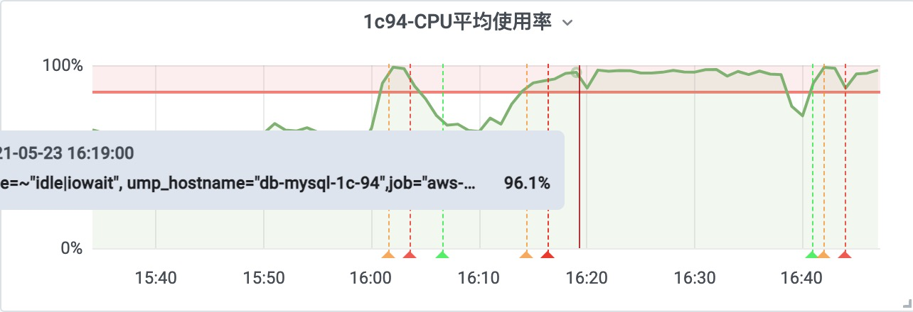
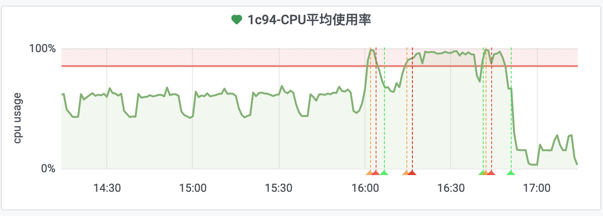

# MySQL雪崩效应调优案例


## 1. 现象描述

有一个业务线, 数据库服务告警:

```
==警报==

1c-94数据库监控告警: CPU平均使用率超过阈值
value: 0.968
```

查看对应的监控指标。

MySQL实例的1分钟CPU使用率平均值 - 超过告警线 0.85:




发现这个问题一直在持续，没有缓解的迹象。


## 2. 问题紧急修复处理

定位到近段时间的部分慢SQL:

```sql
# 执行总次数: 683
# P95耗时为: 1.39秒
# 执行总时长: 757.19秒

select *
from t_risk_action_asset
where 1 = 1
order by f_state, f_gmt_created desc
LIMIT 248000, 1000
```

这里星号是为了排版方便; 实际上是MyBatis生成的列名。


使用 `EXPLAIN` 查看执行计划, 结果为:

```json
{
  "id": 1,
  "select_type": "SIMPLE",
  "table": "t_risk_action_asset",
  "partitions": "",
  "type": "ALL",
  "possible_keys": "",
  "key": "",
  "key_len": "",
  "ref": "",
  "rows": 262487,
  "filtered": 100,
  "Extra": "Using filesort"
}
```

可以看到使用了文件排序.

我们有两个关注的重点:

- 1. 排序语句: `order by f_state, f_gmt_created desc`
- 2. 大分页问题: `LIMIT 248000, 1000`

再看看建表语句:

```sql
CREATE TABLE `t_risk_action_asset` (
  `f_id` bigint(20) unsigned NOT NULL AUTO_INCREMENT COMMENT '主键',
  `f_type` varchar(20) NOT NULL DEFAULT '' COMMENT '业务类型 otctrace',
  `f_user_id` bigint(20) NOT NULL COMMENT 'userId',
  `f_coin` varchar(50) NOT NULL DEFAULT '' COMMENT '冻结币种',
  `f_quantity` decimal(36, 18) NOT NULL COMMENT '冻结数量',
  `f_begin_time` bigint(20) NOT NULL COMMENT '冻结开始时间，毫秒',
  `f_end_time` bigint(20) NOT NULL COMMENT '冻结结束时间，毫秒',
  `f_order_id` varchar(50) NOT NULL DEFAULT '' COMMENT '业务订单id',
  `f_exchange_id` bigint(20) DEFAULT NULL COMMENT '交易所id',
  `f_exchange_code` varchar(50) DEFAULT NULL COMMENT '交易所code',
  `f_reason_desc` varchar(500) NOT NULL DEFAULT '' COMMENT '添加原因',
  `f_state` tinyint(4) NOT NULL DEFAULT '1' COMMENT '状态.1:生效，2:失效',
  `f_source_from` varchar(100) NOT NULL DEFAULT '' COMMENT '添加来源',
  `f_gmt_modified` bigint(20) NOT NULL COMMENT '更新时间',
  `f_gmt_created` bigint(20) NOT NULL COMMENT '入库时间',
  PRIMARY KEY (`f_id`),
  KEY `idx_uniqueKey` (`f_type`, `f_order_id`),
  KEY `idx_user_id` (`f_user_id`),
  KEY `idx_exchange_code` (`f_exchange_code`)
) ENGINE = InnoDB AUTO_INCREMENT = 291899 DEFAULT CHARSET = utf8mb4 COMMENT = '用户资产冻结表'
```

发现没有联合索引。

再根据代码排查，确定是定时任务执行的相关SQL语句。

看看定时任务的配置:

```
# Cron表达式: 30秒执行一次
*/30 * * * * ?
```

30秒执行一次，这个频率有点快。

确定业务短时间内能容忍, 先降低定时任务的执行频率。

修改之后的定时任务配置:

```
# Cron表达式: 5分钟执行一次
20 */5 * * * ?
```

降低执行频率之后, MySQL服务器的CPU使用量有效降低。




## 3. 原因分析


但这里还是缺失了监控，操作日志只记录了增删改操作日志, 没记录查询的，暂时不能确定是哪个业务人员执行的，不知道后续还会不会继续执行。
业务代码后续需要加上慢请求的日志记录。


原因分析为: 雪崩效应。

或者也可以称之为: 压死骆驼的最后一根稻草。

也就是, 平时负载较高的系统，碰到突发事件，资源争抢之后，形成了恶性循环。

25万数据量，每次1000条，大约需要250次左右, 平常的时候，可能只需要0.1秒每条SQL，那么总的25~30秒左右能执行完成。

如果每次SQL平均耗时增加，比如达到 0.5 秒, 那么这就需要120秒。 30秒后下一个定时任务又过来打到某个节点，会进一步加大资源争用。


所以我们看执行计划时，需要关注执行SQL的资源消耗。

有些SQL可能单次执行时间不是很慢，但比较消耗资源。 碰上执行量和并发量增加、或者受到其他业务争抢资源等干扰之后，就有可能会造成连锁反应，就像雪崩一样。

雪崩有3个英文翻译:

```
雪崩
avalanche
snow slide
snowslide
```

雪崩效应, 对应的是 `Avalanche effect`;

相关解释可参考:

- [雪崩效应 - MBA智库百科](https://wiki.mbalib.com/wiki/%E9%9B%AA%E5%B4%A9%E6%95%88%E5%BA%94)


## 4. 进一步优化

- 修改另一个业务的SQL代码; 使用JOIN替代关联子查询, 速度提升10倍以上。
- 加联合索引; 这里因为没有where条件，只增加order by 语句的联合索引。
- 根据最小id范围/id段进行分页， 定时任务的变量，使用id范围替代大分页。
- 资源隔离; 将不同业务的数据库scheme迁移到不同的MySQL实例, 避免干扰。


优化另一个业务的SQL代码。

原来的SQL为:

```sql
select *
from t_risk_user ru
where exists (
    select id from t_risk_user_action rua
    where ru.uid = rua.uid
    and rua.action_code = ?)
# ......    
```

修改为JOIN查询:

```sql
select ru.*
from t_risk_user ru
        JOIN t_risk_user_action rua ON ru.uid = rua.uid
        where rua.action_code = ?
# ......    
```

已经有了相关的索引, 不用改动。

管理端的查询SQL, 因为是人工查询, 执行次数不多, 并发不大, 所以不需要大动干戈, 够用就好。

把资源用在其他更重要的事情上。


时间: 2021年05月23日
