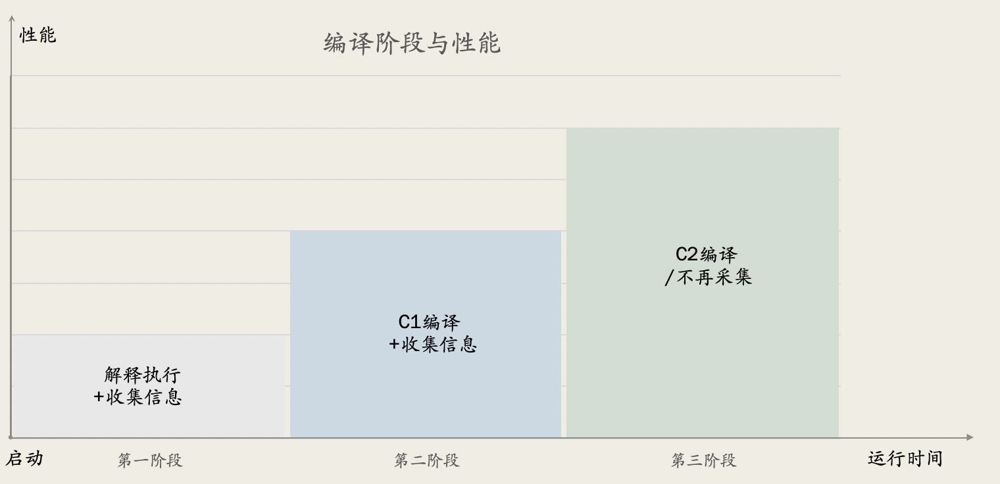

# 深入JVM: 案例详解JIT分层编译技术

> 最后更新日期: 2022年11月09日

## 1. 背景简介

JVM在运行时有两种执行方式:

- 一种是解释执行(interprets), 理论上执行速度较慢, 特别是大规模的循环和计算任务时; 
- 另一种是编译运行(JIT, just-in-time compilation, 即时编译), 可以大幅度提升性能, 比如几十倍上百倍的提升比例。

但是在常规并发量的CRUD程序中, 两者在宏观上可能看不出明显区别, 因为时间主要消耗在其他地方, 比如网络IO交互之类的步骤上。

JIT编译器能大幅提升程序性能, 也分为两款; 

- 一款被称为 客户端编译器(Client Complier), 设计目标是为了让Java程序具有较快的启动速度; 主要使用场景是 AWT/Swing 之类的图形界面客户端;
- 另一款称为 服务端编译器(Server Complier), 设计目标是为了在整体上有更好的性能表现; 顾名思义, 主要使用场景是需要长时间运行的服务端系统。

在老一点的 Java 版本中, 我们需要手动指定 Hotspot JVM 使用哪一款即时编译器;

为了兼容更复杂的使用场景, 达成更好的性能表现, 从 Java 7 版本开始, JVM 引入了分层编译技术(tiered compilation)。

本文简要介绍这两款不同的JIT编译器; 并详细介绍分层编译技术(Tiered Compilation)和其中的5种编译级别; 最后再通过具体示例, 分析编译日志, 来深入学习JIT编译的运行原理。


## 2. JIT 编译器

即时编译器(JIT compiler)的作用, 是将执行频率较高的字节码(bytecode)编译为本地机器码(native code)。 

频繁执行的代码被称为 热点代码(hotspots), 这也是 Hotspot JVM 这个名字的由来。

通过即时编译技术, Java 程序的执行性能大幅提升, 和纯编译类型的语言差不多。

当然, 在实际的软件开发实践中, 代码质量也是一个影响很大的因素。 

> 使用高级语言开发的复杂系统, 比起用低级语言开发, 在同样的“开发成本”下, 高级语言系统的综合质量要优越很多。

Hotspot JVM 提供了 2 种类型的JIT编译器:


### 2.1. 客户端版本的编译器: C1

客户端版本的编译器(client compiler), 称为 C1, 是JVM内置的一款即时编译器, 其中的一个目的是为了让 Java应用启动更快完成.  所以会尽可能快地将代码优化并编译为机器代码.

最初, C1主要的应用场景是生命周期较短的客户端应用程序, 对这类应用而言, 启动时间是一个很重要的非功能性需求。 

在Java8之前的版本中, 需要指定 `-client` 启动参数来设置 C1 编译器, 但在Java8以及更高的Java版本中, 这个参数就没有任何作用了, 保留下来只是为了不报错。

> 验证命令: `java -client -version`


### 2.2. 服务端版本的编译器: C2

服务端版本的编译器(server compiler), 称为 C2, 是一款性能更好的, JVM内置的即时编译器(JIT compiler), 适用于生命周期更长的应用程序, 主要的使用场景就是服务端应用。
C2会监测和分析编译后的代码执行情况, 通过这些分析数据, 就可以生成和替换为更优化的机器代码。

在Java8之前的版本中, 需要指定 `-server` 启动参数来设置 C2 编译器, 但在Java8以及更高的Java版本中, 这个参数就没有任何作用了, 保留下来也是为了不报错。


> 验证命令: `java -server -version`


### 2.3. Graal JIT 编译器

Java 10及之后的版本, 开始支持 Graal JIT 编译器, 这是一款可以平替 C2 的编译器。 

其特征是既支持即时编译模式(just-in-time compilation mode), 也支持预先编译模式(ahead-of-time compilation mode)。

预先编译模式就是在程序启动之前, 将Java字节码全部编译为本地代码。


## 3. 分层编译技术(Tiered Compilation)

对同一个方法进行编译, 相比起C1来说, C2编译器需要更多的CPU和内存, 但可以生成高度优化,性能卓越的本地代码。

从Java 7 版本开始, JVM引入了分层编译技术, 目标是综合利用 C1 和 C2, 实现快速启动和长时间高性能运行之间的平衡。

混合模式示例:

```sh
$ java -client -version

openjdk version "1.8.0_191"
OpenJDK Runtime Environment (build 1.8.0_191-b12)
OpenJDK 64-Bit Server VM (build 25.191-b12, mixed mode)
```

`java -version` 命令, 输出内容中的 `mixed mode`, 就是这个意思。


### 3.1. 汇集两者的优点

混合编译的整个过程如下图所示:




第一阶段: 

应用启动之后, JVM先是解释执行所有的字节码, 并采集方法调用相关的各种信息。
接下来, JIT 编译器对采集到的数据进行分析, 找出热点代码。

第二阶段:

启动C1, 将频繁执行的方法, 快速编译为本地机器码。

第三阶段:

收集到足够的信息以后, C2介入; C2会消耗一定的编译时间, 采用更激进的方式, 将代码重新编译为高度优化的本地机器码, 以提高性能。

总体来看，C1 可以快速提高代码执行效率, C2可以基于热点代码分析数据, 让编译后的本地代码性能继续提升。


## 参考文档

- <https://www.baeldung.com/jvm-tiered-compilation>
