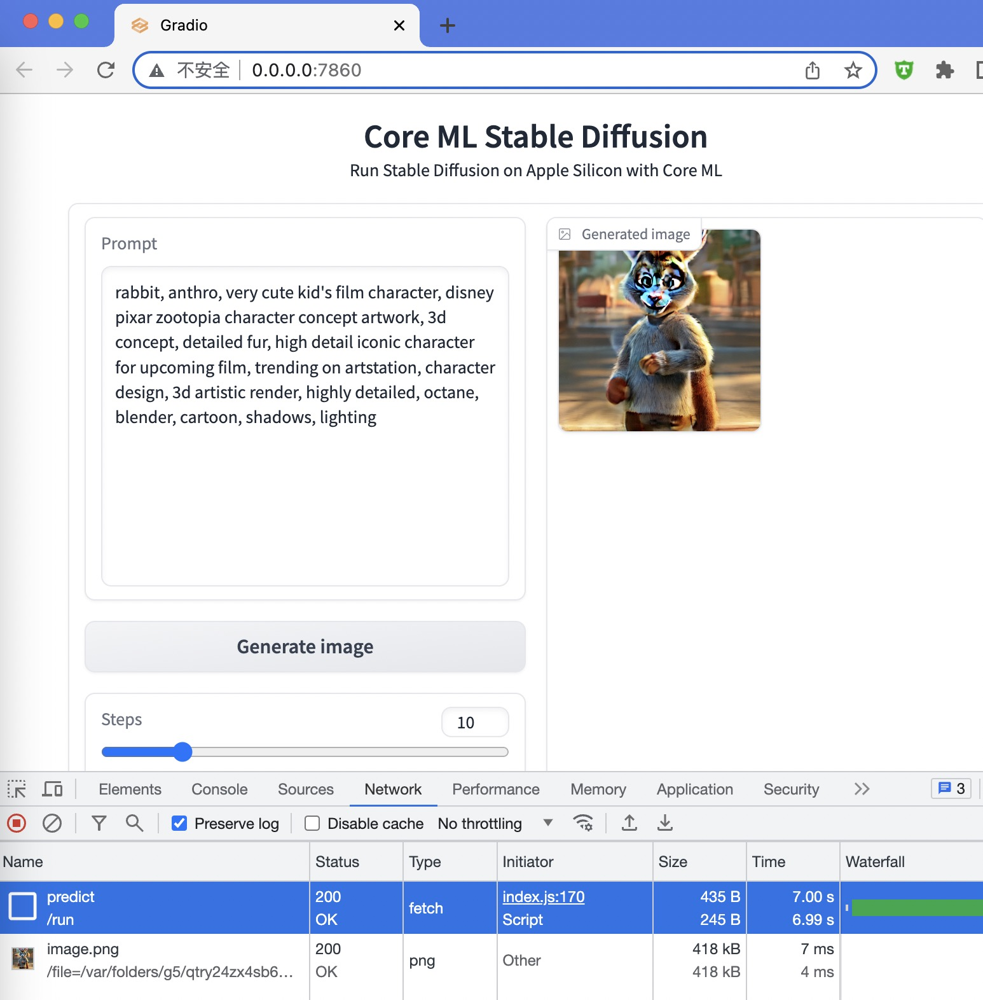

# MAC M1 搭建 stable-diffusion 环境

[TOC]

苹果公司的程序员为 M1,M2 之类的ARM64芯片专门创建了一个  stable-diffusion 的仓库:

> Run Stable Diffusion on Apple Silicon with Core ML

链接为: <https://github.com/apple/ml-stable-diffusion>

可以充分利用  M1 内置的人工智能芯片(神经网络芯片), 需要转换 PyTorch 模型为 Apple Core ML 模型。

本文基于这个仓库进行操作。

## 环境准备

### 1. 硬件环境

- M1芯片的Apple MacBook Pro
- 16G内存; 8G也可以, 但是需要一些额外的配置。

### 2. 系统环境

- MAC OS 13.4; 至少得升级到 13 版本(Ventura); 参考: [System Requirements](https://github.com/apple/ml-stable-diffusion#system-requirements)

### 3. 基础软件环境

- git: 下载仓库源码;  理论上需要更新到最新版
- conda: 主要用来创建Python环境
- Python: 需要3.8 版本, 高了低了都不行, 使用 conda 来安装即可。


conda下载页面为: <https://docs.conda.io/en/latest/miniconda.html>


## 主要参考资料

网上找了很多资料, 折腾了很多次, 发现这篇比较好:

- [在搭载 M1 及 M2 芯片 MacBook 设备上玩 Stable Diffusion 模型 - 知乎](https://zhuanlan.zhihu.com/p/590869015)

如果碰到问题, 请打开这个页面查看。


## 操作步骤

### 1. 下载git

参考官方网站: <https://git-scm.com/downloads>

下载或者安装好即可。

### 2. 下载conda

参考官方网站: <https://docs.conda.io/en/latest/miniconda.html>

下载 miniconda 并安装即可。

miniconda是一个简化版, 只内置了python。 其他什么 C++, Java什么的环境都暂时去除了。

### 3. 创建python环境

参考: <https://zhuanlan.zhihu.com/p/590869015>

对应的命令为:

```shell
# 创建和准备Python环境
conda create -n coreml_stable_diffusion python=3.8 -y

# 查看conda的环境列表
conda env list

# 激活特定环境
conda activate coreml_stable_diffusion

## 查看Python版本, 注意是大V
python -V

```

这些环境的作用域范围是操作系统用户级别的。 主要是shell中使用。

### 4. 下载仓库

使用的命令为:

```shell
git clone https://github.com/apple/ml-stable-diffusion.git

```

github支持下载zip包, 但身处天国的话得需要一些技巧才能下载成功。

如果速度过慢, 可能你需要一些下载技巧, 比如购买网络服务。


### 5. 安装依赖

```shell
# 进入仓库目录
cd ml-stable-diffusion

# 激活特定环境
conda activate coreml_stable_diffusion

# 安装python依赖; pip 是和 python 环境一起自动安装的;
pip install -r requirements.txt

```

如果速度过慢, 可能你需要一些下载技巧, 比如购买网络服务。

如果因为网速原因安装失败, 可以再次重复执行安装。


### 6. 转换模型

为了利用  M1 内置的人工智能芯片(神经网络芯片), 需要转换 PyTorch 模型为 Apple Core ML 模型。


转换模型对应的命令为:

```shell
# 进入仓库目录
cd ml-stable-diffusion

# 激活特定环境
conda activate coreml_stable_diffusion

# 模型转换; 需要下载几个GB的文件
# (默认值是脚本里面内置的1.4版本)
python -m python_coreml_stable_diffusion.torch2coreml --convert-unet --convert-text-encoder --convert-vae-decoder --convert-safety-checker -o ./models


# 转换其他模型
python -m python_coreml_stable_diffusion.torch2coreml --convert-unet --convert-text-encoder --convert-vae-decoder --convert-safety-checker --model-version runwayml/stable-diffusion-v1-5 -o ./models_1.5

python -m python_coreml_stable_diffusion.torch2coreml --convert-unet --convert-text-encoder --convert-vae-decoder --convert-safety-checker --model-version stabilityai/stable-diffusion-2-base -o ./models_2

python -m python_coreml_stable_diffusion.torch2coreml --convert-unet --convert-text-encoder --convert-vae-decoder --convert-safety-checker --model-version stabilityai/stable-diffusion-2-1-base -o ./models_2.1

python -m python_coreml_stable_diffusion.torch2coreml --convert-unet --convert-text-encoder --convert-vae-decoder --convert-safety-checker --model-version xiaolxl/GuoFeng3 -o ./models_GuoFeng3


```

执行正常的话, 可以看到有一个 `ANECompilerService` 进程在消耗CPU, 这就是苹果的神经网络引擎(Apple Neural Engine)编译器。

如果内存不够的话, 尝试先关掉一些其他程序。


我这里在执行过程中报了一个错:

```py
RuntimeError: PyTorch convert function for op 'scaled_dot_product_attention' not implemented.
```

解决办法, 参考: <https://blog.csdn.net/cainiao1412/article/details/131204867>

```shell
pip show torch # 查看torch版本
pip uninstall torch # 卸载torch版本
pip install torch==1.13.1 # 安装指定版本
```

报错的话, 切换 torch 版本, 然后再次执行模型转换的命令。


### 7. 验证和测试


使用的命令为:

```shell
python -m python_coreml_stable_diffusion.pipeline --prompt "magic book on the table" -i ./models -o ./output --compute-unit ALL --seed 93

```

因为需要初始化环境, 加载模型和处理, 所以过程比较慢, 我这里需要好几分钟。


### 8. 构造Web界面

好处是不需要每次执行提示词 prompt 都去初始化一次环境。

安装gradio, 参考: <https://www.gradio.app/quickstart/>

对应的安装命令为:

```shell
pip install gradio

```

然后参考 <https://zhuanlan.zhihu.com/p/590869015> 专栏中提到的脚本:

- [python_coreml_stable_diffusion/web.py](https://raw.githubusercontent.com/apple/ml-stable-diffusion/be26d3cc5b682479762f37301668cc9c95ec68e2/python_coreml_stable_diffusion/web.py)

[web.py](./web.py) 文件准备完成后, 启动命令为:

```shell
# 进入仓库目录
cd ml-stable-diffusion

# 激活特定环境
conda activate coreml_stable_diffusion

# 启动WebUI
python -m python_coreml_stable_diffusion.web -i ./models --compute-unit ALL

```

启动需要加载环境, 会消耗一些时间。

启动完成后, 会看到命令行给出访问网址, 例如: <http://0.0.0.0:7860>

### 9. 测试WebUI


打开访问网址, 例如: <http://0.0.0.0:7860>

找一个支持的模板, 改造一下, 例如:

```shell
rabbit, anthro, very cute kid's film character, disney pixar zootopia character concept artwork, 3d concept, detailed fur, high detail iconic character for upcoming film, trending on artstation, character design, 3d artistic render, highly detailed, octane, blender, cartoon, shadows, lighting
```

输入词汇之后, 点击生成, 等待即可。




可以看到, 这个配置, 使用WebUI界面只需要7秒左右即可出图, 文件大小在500KB左右。


这个 WebUI 还是有一些问题, 有时候会生成一张黑图, 碰到的话刷新页面重试即可。


网上有很多提示词模板, 著名的有: https://github.com/Dalabad/stable-diffusion-prompt-templates

当然, 模板的好处就是, 可以把 `rabbit` 换成 `tiger` 之类词汇的试试.


### 10. 关闭环境

webUI 开启的时候, python 会占用很多内存, 不需要时, 从控制台 `CTRL+C` 关闭即可, 或者粗暴一点直接杀进程。


### 11. 集成App


Windows系统下有很多一键安装脚本, 搜索关键字即可: `windows stable diffusion 一键安装`


找了一下, MAC系统中也有类似的, 支持 Intel 以及M1/M2芯片。

- [Diffusion Bee - Stable Diffusion GUI App for MacOS](https://diffusionbee.com/)


## 踩坑日记

### 1. brew 更新不成功

原因是切换了国内的源。 但是, 国内的源比较坑, 经常不兼容或者报错。

重置 brew 源, 参考: [更换和重置Mac Homebrew的默认源](https://www.jianshu.com/p/b197872aecca)

本质上 brew 就是依赖了几个 git 仓库, 所以有问题的话可以直接通过git处理一下对应的那几个目录。

### 2. 转换模型报错

报错信息为:

```py
RuntimeError: PyTorch convert function for op 'scaled_dot_product_attention' not implemented.
```

解决办法, 参考: https://blog.csdn.net/cainiao1412/article/details/131204867

```shell
pip show torch # 查看torch版本
pip uninstall torch # 卸载torch版本
pip install torch==1.13.1 # 安装指定版本
```

OK, 1.3.1 版本可以成功处理。


### 3. 网络问题

强的厉害, 经常网络超时, 这时候就需要技巧了。


## 相关链接


- [在搭载 M1 及 M2 芯片 MacBook 设备上玩 Stable Diffusion 模型 - 知乎](https://zhuanlan.zhihu.com/p/590869015)


作者: [铁锚](https://github.com/cncounter/translation/)
日期: 2023年06月20日
